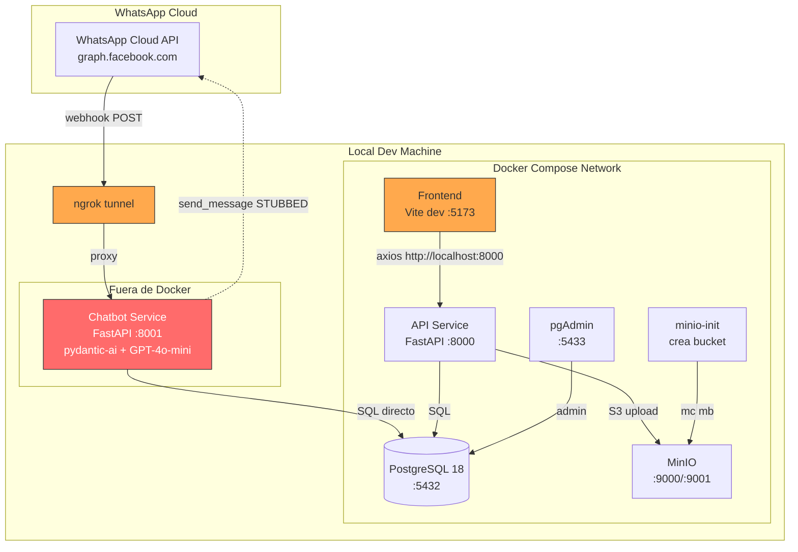
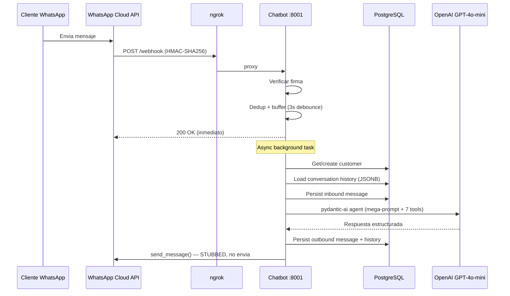

# Plan de Produccion — Toilav Bot (Tremenda Nuez)

> Generado el 2026-04-18 a partir del analisis completo del codebase.
> Actualizado 2026-04-18: estrategia de Meta/WhatsApp ajustada — WABA de Toilav con numero de prueba para Sprints 1-4, migracion del numero real de Tremenda Nuez en Sprint 5 via coexistencia (App + API).
> Actualizado 2026-04-19: multi-tenancy descoped del primer deploy. El codigo queda single-tenant; la WABA de Toilav se configura multi-numero solo a nivel Meta (sin costo). Los gaps de multitenancy quedan documentados como trabajo futuro (ver Seccion 2.3 y Decision 7).
> Objetivo: bot de WhatsApp respondiendo clientes reales de Tremenda Nuez (Torreon).

---

## 1. Inventario tecnico

### 1.1 Servicios actuales

| Servicio | Puerto | Tecnologia | Docker | Estado |
|---|---|---|---|---|
| **PostgreSQL 18** | 5432 | postgres:18-alpine | Si (docker-compose) | Funcional |
| **API / Backend** | 8000 | FastAPI + SQLModel + boto3 | Si (docker-compose) | Funcional |
| **Chatbot** | 8001 | FastAPI + pydantic-ai + OpenAI GPT-4o-mini | Tiene Dockerfile, **NO** esta en docker-compose | Funcional local |
| **Frontend** | 5173 | React 19 + Vite 7 + Tailwind 4 + shadcn/ui | Si (docker-compose, **modo dev**) | Funcional |
| **MinIO** | 9000/9001 | minio/minio:latest | Si (docker-compose) | Funcional |
| **pgAdmin** | 5433 | dpage/pgadmin4:9.13 | Si (docker-compose) | Solo dev |
| **ngrok** | — | Tunel local | Manual | Solo dev |

### 1.2 Diagrama de arquitectura actual



### 1.3 Flujo de un mensaje de WhatsApp



---

## 2. Gap analysis para produccion

### 2.1 Infraestructura

| # | Gap | Detalle | Severidad |
|---|-----|---------|-----------|
| I1 | **Sin hosting cloud** | Todo corre en laptops locales. Necesitamos un host para API, chatbot, y frontend | BLOQUEANTE |
| I2 | **Sin dominio ni SSL** | WhatsApp exige webhook HTTPS con certificado valido. Hoy se usa ngrok | BLOQUEANTE |
| I3 | **Chatbot fuera de docker-compose** | No tiene servicio en docker-compose. Se corre manualmente con `uv run python main.py` | ALTO |
| I4 | **Frontend en modo dev** | Dockerfile ejecuta `npm run dev`, no `npm run build`. Sirve codigo sin minificar, HMR activo | ALTO |
| I5 | **API URL hardcodeada** | `const API = "http://localhost:8000"` en los 4 archivos de paginas (Catalog.jsx, Orders.jsx, FAQ.jsx, Metrics.jsx) | ALTO |
| I6 | **MinIO URL hardcodeada** | `MINIO_PUBLIC_URL=http://localhost:9000` — imagenes inaccesibles fuera de la maquina local | ALTO |
| I7 | **Sin reverse proxy** | No hay nginx/caddy. Cada servicio expone su puerto directamente | MEDIO |
| I8 | **Variables de entorno dispersas** | Chatbot y API tienen configs separadas (`config.py` vs `.env`), con defaults distintos para el mismo DB | MEDIO |

### 2.2 WhatsApp / Meta

> **Estrategia**: Toilav es el proveedor de la plataforma y tiene su propia WABA con un numero de prueba dedicado (SIM barata). Sprints 1-4 usan solo ese numero para testing interno (Carlos y Kevin). El numero real de Tremenda Nuez se migra en Sprint 5 con modo **coexistencia**, manteniendo WhatsApp Business App como fallback del dueño para poder revertir si algo falla.

| # | Gap | Detalle | Severidad |
|---|-----|---------|-----------|
| W1 | **Sin WABA de Toilav** | Falta crear Meta Business Manager + WhatsApp Business Account a nombre de **Toilav** (el proveedor), no de Tremenda Nuez. Una sola WABA puede hospedar hasta 20 numeros (= 20 tenants) | BLOQUEANTE |
| W2 | **Sin numero de prueba dedicado** | Se necesita una SIM barata (Telcel prepago o similar) registrada en la WABA de Toilav. Es el unico numero que veran el bot y los desarrolladores durante Sprints 1-4. El numero real de Tremenda Nuez **no se toca** hasta Sprint 5 | BLOQUEANTE |
| W3 | **send_message() esta STUBBED** | `whatsapp_utils.py:417` — hay un `return` antes del `httpx.post()`. El bot recibe pero nunca responde | BLOQUEANTE |
| W4 | **Migracion del numero real de Tremenda Nuez sin plan** | El dueño usa WhatsApp Business App (no API) hoy. Migrar a API reemplaza su flujo actual. Hay que decidir el modo: **coexistencia** (App + API en el mismo numero, el dueño sigue viendo mensajes como fallback y puede desconectar si algo falla) vs full-takeover vs numero nuevo. Ver Decision 6 | ALTO |
| W5 | **OPENAI_API_KEY no en config** | La key de OpenAI la detecta pydantic-ai del environment pero no esta declarada en `config.py` ni documentada | ALTO |
| W6 | **Owner commands stub** | `handle_owner_command()` solo parsea el comando pero no ejecuta la mayoria de acciones | MEDIO |

### 2.3 Multitenancy (post-lanzamiento — no bloquea primer deploy)

> Contexto: el primer deploy maneja un solo tenant (Tremenda Nuez). La WABA de Toilav se configura como plataforma multi-numero desde Sprint 0 (esto no cuesta nada: Meta soporta hasta 20 numeros por WABA), pero el **codigo** permanece single-tenant: `PHONE_NUMBER_ID` y `OWNER_WA_ID` siguen siendo variables de entorno globales. Cuando entre el segundo cliente, estos gaps se resuelven en un update dedicado. Ninguno es bloqueante para Tremenda Nuez.

| # | Gap | Detalle | Severidad |
|---|-----|---------|-----------|
| M1 | **Webhook no rutea por phone_number_id** | El chatbot asume un solo `PHONE_NUMBER_ID` en `config.py`. Para multi-tenant habra que extraer el `phone_number_id` del payload de Meta y cargar el `Store` correspondiente desde DB | FUTURO |
| M2 | **Store sin phone_number_id ni owner_wa_id** | El modelo `Store` no tiene columnas para `phone_number_id` ni `owner_wa_id`. Para multi-tenant hay que agregarlas via Alembic | FUTURO |
| M3 | **System prompt y tools son globales** | El mega-prompt y las tools del agente estan hardcoded. Cada tienda futura tendra productos, tono, bank info y FAQ distintos; habra que parametrizar el prompt con datos del `Store` cargado | FUTURO |
| M4 | **send_message no identifica el numero origen** | `send_message()` usa el `PHONE_NUMBER_ID` global del settings. En multi-tenant cada `Store` tendra el suyo; la funcion deberia recibirlo como parametro | FUTURO |
| M5 | **RAG sin namespace por store** | Cuando se implemente pgvector, los embeddings de FAQ y productos deberan filtrarse por `store_id` para no mezclar conocimiento entre tenants | FUTURO |

### 2.4 Base de datos

| # | Gap | Detalle | Severidad |
|---|-----|---------|-----------|
| D1 | **Sin backups** | PostgreSQL corre en volumen Docker local. Si se borra el volumen, se pierde todo | ALTO |
| D2 | **Sin migraciones** | No hay Alembic ni herramienta de migracion. Cambios de schema = recrear tablas (pierde datos) | ALTO |
| D3 | **Sin connection pooling** | Chatbot usa `create_engine()` sin configurar pool. En carga, puede agotar conexiones | MEDIO |
| D4 | **DB name inconsistente** | API usa `DATABASE_NAME=tremenda-test`, chatbot default es `POSTGRES_DB=chatbot` — funciona solo porque ambos leen de `.env`, pero los defaults divergen | MEDIO |
| D5 | **Seed no es automatico** | Hay que ejecutar `psql < seed_pg.sql` manualmente despues de levantar containers | BAJO |

### 2.5 Storage de imagenes

| # | Gap | Detalle | Severidad |
|---|-----|---------|-----------|
| S1 | **MinIO solo accesible localmente** | `MINIO_PUBLIC_URL=http://localhost:9000` — URLs de imagenes rotas para cualquier cliente externo | ALTO |
| S2 | **Credenciales por defecto** | `minioadmin/minioadmin` hardcodeadas en docker-compose.yml | ALTO |
| S3 | **Sin CDN** | Imagenes servidas directamente desde MinIO sin cache ni compresion | BAJO |

### 2.6 Seguridad

| # | Gap | Detalle | Severidad |
|---|-----|---------|-----------|
| X1 | **Dashboard sin autenticacion** | Cualquiera con la URL puede ver/editar/borrar productos, ordenes y FAQs | CRITICO |
| X2 | **API sin autenticacion** | Todos los endpoints de `/products`, `/orders`, `/faqitems` son publicos | CRITICO |
| X3 | **CORS abierto** | `allow_origins=["*"]` en el API. Cualquier sitio puede hacer requests | ALTO |
| X4 | **Secrets en texto plano** | Password de DB es `tu_password_aqui`, MinIO es `minioadmin`. No hay vault ni secrets manager | ALTO |
| X5 | **pgAdmin expuesto** | Puerto 5433 accesible con `admin@admin.com / password` | ALTO |
| X6 | **Sin rate limiting** | Ni en el webhook del chatbot ni en la API del dashboard | MEDIO |

### 2.7 Observabilidad

| # | Gap | Detalle | Severidad |
|---|-----|---------|-----------|
| O1 | **Sin logging centralizado** | Logs solo en stdout de cada container. Si el container se reinicia, se pierden | ALTO |
| O2 | **Sin error tracking** | No hay Sentry ni equivalente. Errores del LLM o de WhatsApp pasan silenciosamente | ALTO |
| O3 | **Sin metricas de infra** | No hay monitoreo de CPU, memoria, espacio en disco, latencia de DB | MEDIO |
| O4 | **Sin alertas** | Nadie se entera si el bot se cae a las 3am | MEDIO |
| O5 | **Sin dashboard de costos LLM** | GPT-4o-mini se cobra por token. Sin tracking, el costo puede sorprender | BAJO |

### 2.8 CI/CD

| # | Gap | Detalle | Severidad |
|---|-----|---------|-----------|
| C1 | **Sin pipeline** | Deploy es manual: SSH + docker-compose up. No hay GitHub Actions ni equivalente | ALTO |
| C2 | **Sin ambiente de staging** | Cambios van directo a produccion (cuando exista) | MEDIO |
| C3 | **Sin build del frontend** | No hay paso de `npm run build` en ningun pipeline | MEDIO |

### 2.9 Tests

| # | Gap | Detalle | Severidad |
|---|-----|---------|-----------|
| T1 | **Tests del chatbot existen pero no corren en CI** | 858 lineas de tests en `app/services/chatbot/tests/` — webhook, dedup, seguridad, formateo. No se ejecutan automaticamente | MEDIO |
| T2 | **Sin tests de la API** | El servicio de database/API no tiene ningun test | MEDIO |
| T3 | **Sin tests del frontend** | No hay Vitest ni Playwright | BAJO |
| T4 | **Sin test end-to-end** | No hay simulacion de un mensaje WhatsApp completo pasando por todo el sistema | BAJO |

---

## 3. Decisiones tecnicas pendientes

### Decision 1: Plataforma de hosting

| Opcion | Pros | Contras | Costo estimado |
|--------|------|---------|----------------|
| **Railway** | Deploy desde GitHub en 1 click. Soporte nativo Docker. PostgreSQL y Redis managed. Facil para equipos chicos | Almacenamiento limitado en plan free. Networking entre servicios simple pero sin mucho control | ~$5-15 USD/mes (Hobby) |
| **Fly.io** | Maquinas globales, buen networking. Postgres managed (LiteFS). Buen free tier | Mas complejo de configurar. CLI propia. Fly Postgres es basicamente una VM, no managed real | ~$5-15 USD/mes |
| **DigitalOcean App Platform** | Simple, predecible. Managed DB disponible. Buen soporte Docker | Mas caro que Railway para lo mismo. Deploy mas lento | ~$12-24 USD/mes |
| **VPS (Hetzner/DigitalOcean Droplet)** | Maximo control. Mas barato a largo plazo. Docker Compose casi igual que local | Hay que administrar el server: updates, firewall, SSL manual. Mas trabajo ops | ~$5-10 USD/mes |

**Recomendacion**: **Railway** para arrancar rapido. 3 servicios (API, chatbot, frontend) + PostgreSQL addon + variables de entorno desde la UI. Si el costo se vuelve problema, migrar a VPS despues.

### Decision 2: Base de datos

| Opcion | Pros | Contras |
|--------|------|---------|
| **Railway PostgreSQL** | Misma plataforma, zero-config networking, backups diarios incluidos | Limitado a 1GB en plan hobby. Sin extensiones avanzadas en free tier |
| **Supabase** | Free tier generoso (500MB). Dashboard incluido. Auth, Storage, Realtime gratis | Latencia si el server esta en otra region. Vendor lock-in leve. Pause por inactividad en free |
| **Neon** | Serverless PostgreSQL, scale-to-zero. Branching para dev. Free tier 0.5GB | Relativamente nuevo. Cold starts |

**Recomendacion**: **Railway PostgreSQL** si el hosting es Railway (simplicidad). Si no, **Supabase** free tier para empezar.

### Decision 3: Storage de imagenes

| Opcion | Pros | Contras |
|--------|------|---------|
| **Cloudflare R2** | S3-compatible (boto3 funciona igual). Sin egress fees. 10GB free. CDN global gratis | Solo storage, no tiene procesamiento de imagenes |
| **Supabase Storage** | Integrado si ya usas Supabase. Transformaciones de imagen incluidas | Vendor lock-in. 1GB en free tier |
| **AWS S3** | El estandar. boto3 nativo (ya lo usan). Infinitamente escalable | Egress fees. Mas complejo de configurar IAM |
| **MinIO hosteado** | Mismo codigo que hoy. Sin cambios | Hay que hostear y mantener un server. No tiene CDN |

**Recomendacion**: **Cloudflare R2**. Es compatible con S3/boto3 (el codigo actual usa boto3, cambio minimo: solo endpoint URL + credenciales). 10GB gratis. Sin costo de egress. Ya tienen CDN global.

### Decision 4: Modelo de LLM

| Opcion | Pros | Contras | Costo estimado |
|--------|------|---------|----------------|
| **GPT-4o-mini** (actual) | Ya funciona. Rapido. Barato. Buenas herramientas | Vendor lock-in OpenAI. Precio puede subir | ~$0.15-0.60/1M tokens input |
| **Claude Haiku 4.5** | Mas barato. Excelente en espanol. pydantic-ai lo soporta | Requiere cambiar de provider en pydantic-ai (trivial) | ~$0.80/1M input, $4/1M output |
| **Llama 3 (self-hosted)** | Sin costo por token. Sin vendor lock-in | Necesita GPU. Complejidad ops enorme. No vale para equipo de 2 | $30+/mes por GPU |

**Recomendacion**: **Quedarse con GPT-4o-mini** por ahora. Es lo mas barato y ya funciona. Monitorear costos. Si escala, evaluar Haiku.

### Decision 5: Auth del dashboard

| Opcion | Pros | Contras |
|--------|------|---------|
| **Clerk** | UI lista. Free tier (10K MAU). React SDK. Setup en 1 hora | Dependencia externa |
| **Auth.js (NextAuth)** | Open source. Multiples providers | Requiere algo de backend. Mas trabajo |
| **Basic Auth casero** | Ya tienen tabla `Users` con `u_password_hash`. Solo falta endpoint de login + JWT | Minimo, pero hay que escribir todo |
| **Supabase Auth** | Gratis si ya usan Supabase. Email/password + OAuth | Vendor lock-in |

**Recomendacion**: **Basic auth casero con JWT**. Ya tienen la tabla `Users` con roles (ADMIN, OWNER, MANAGER, STAFF) y `u_password_hash`. Solo hay que agregar: endpoint `POST /auth/login` que devuelva JWT, middleware que valide el token en endpoints protegidos, y en el frontend un `<Login />` que guarde el token en localStorage.

### Decision 6: Estrategia para migrar el numero real de Tremenda Nuez

| Opcion | Pros | Contras |
|--------|------|---------|
| **Coexistencia (App + API, mismo numero)** | El dueño sigue viendo mensajes en WhatsApp Business App como fallback. Si el bot falla o responde mal, puede desconectar el numero de la API desde Meta dashboard y seguir operando manualmente. Riesgo bajisimo. Meta soporta este modo desde 2023 | Mensajes entrantes llegan a ambos lados. Hay que instruir al dueño a no responder si el bot ya lo hizo. Al mandar mensajes el dueño desde App, el bot no los ve |
| **Full-takeover (solo API)** | Un solo punto de respuesta, sin duplicacion. Experiencia mas limpia | Si el bot falla, el negocio se queda sin canal de atencion. Rollback requiere re-instalar WhatsApp Business App y re-claim del numero (proceso de dias con Meta) |
| **Numero nuevo dedicado a API** | Cero riesgo sobre el numero existente del dueño | Se pierde el historial de conversaciones y contactos. Los clientes tienen que re-contactar. Requiere anuncio publico y campaña de migracion |

**Recomendacion**: **Coexistencia.** El dueño nunca pierde control del numero. Rollback = toggle en Meta dashboard en minutos. Es el modo que recomienda Meta para migraciones suaves de Business App a API. Pre-requisito: la version de WhatsApp Business App del dueño debe ser >= 2.23.x (verificar en Sprint 0).

### Decision 7: Cuando implementar el routing multi-tenant

| Opcion | Pros | Contras |
|--------|------|---------|
| **Desde Sprint 1** | Arquitectura limpia desde el inicio; ningun refactor tardio | Tiempo invertido antes de que aporte valor (solo hay un numero de prueba durante 4 semanas). Puede sobre-disenarse sin caso real |
| **Sprint 4 (antes del lanzamiento)** | Se implementa justo antes de que haya un segundo tenant real (Tremenda Nuez en Sprint 5). Permite iterar rapido en single-tenant durante el testing interno | Refactor considerable si la logica single-tenant esta muy enraizada. Riesgo de introducir bugs cerca del lanzamiento |
| **Post-lanzamiento (cuando entre el segundo tenant)** | Evita trabajo prematuro | Refactor bajo presion comercial con un cliente esperando. Mas caro a largo plazo |

**Recomendacion**: **Post-lanzamiento.** El primer deploy maneja solo a Tremenda Nuez, asi que invertir en routing multi-tenant antes del lanzamiento es trabajo sin payoff inmediato. La WABA de Toilav ya queda configurada como multi-numero desde Sprint 0 (no cuesta nada hacerlo asi), y los gaps M1-M5 quedan documentados en la Seccion 2.3. Cuando llegue el segundo cliente se resuelven todos juntos en un update dedicado (~1-2 dias de trabajo con el schema ya preparado). Trade-off aceptado: si el segundo cliente llega con urgencia, habra presion comercial durante ese refactor.

---

## 4. Sprint plan

> Capacidad estimada: 2 personas x 10-15 hrs/semana c/u = 20-30 hrs/semana combinadas.
> Persona A = mas backend/infra. Persona B = mas frontend/integracion.

### Sprint 0 — Pre-requisitos (hacer YA, no requiere codigo)

| Tarea | Quien | Tiempo est. | Notas |
|-------|-------|-------------|-------|
| Crear Meta Business Manager a nombre de **Toilav** | A o B | 30 min | business.facebook.com — Toilav es el proveedor de la plataforma. Necesitan RFC/documentos fiscales de Toilav. Tremenda Nuez sera el primer tenant, no el titular |
| Solicitar verificacion de negocio en Meta (Toilav) | A o B | 1-2 hrs | Sube documentos fiscales de Toilav. Aprobacion tarda 2-7 dias habiles |
| Crear WhatsApp Business Account (WABA) dentro del BM de Toilav | A o B | 30 min | Una sola WABA hospedara hasta 20 numeros — un numero por tenant. Tremenda Nuez sera el primero en Sprint 5 |
| Comprar SIM prepago barata para numero de prueba | A o B | 30 min | Telcel/AT&T. NO usar numero personal de Carlos, Kevin ni del dueño. Este sera el unico numero que ve el bot durante Sprints 1-4 |
| Registrar numero de prueba en la WABA de Toilav | A | 30 min | Verificacion via SMS/llamada. Guardar el `phone_number_id` que devuelve Meta — sera la unica credencial que use el bot hasta Sprint 5 |
| Verificar version de WhatsApp Business App del dueño de Tremenda Nuez | A o B | 15 min | Debe ser >= 2.23.x para soportar coexistencia con API en Sprint 5. Si esta desactualizada, pedirle que actualice |
| Crear cuenta en Railway | A | 15 min | Conectar repo de GitHub |
| Crear cuenta Cloudflare (R2 + DNS) | B | 15 min | — |
| Comprar dominio de la plataforma (ej: `toilav.com`) | A o B | 15 min | Cloudflare Registrar o Namecheap. Dominio de Toilav (plataforma), no de un tenant especifico |

> **IMPORTANTE**: La verificacion de Meta tarda dias. Iniciar Sprint 0 inmediatamente.
> **NO tocar el numero real de Tremenda Nuez en este sprint.** El dueño sigue usando WhatsApp Business App sin cambios. La migracion con coexistencia ocurre en Sprint 5, ya con todo probado.

---

### Sprint 1 — Infraestructura base (Semana 1)

**Meta: API y chatbot corriendo en la nube con HTTPS.**

#### Persona A — Backend cloud

| Tarea | Horas | Ref gap |
|-------|-------|---------|
| Agregar chatbot como servicio en docker-compose (o Dockerfile standalone para Railway) | 2 | I3 |
| Configurar PostgreSQL managed en Railway | 1 | D1 |
| Deploy API a Railway (conectar repo, configurar env vars) | 2 | I1 |
| Deploy chatbot a Railway | 2 | I1 |
| Configurar dominio + SSL en Railway (ej: `api.toilav.com`) | 1 | I2 |
| Configurar variables de entorno en Railway: DB, OpenAI, WhatsApp tokens | 1 | I8 |
| Generar passwords reales para DB y servicios | 1 | X4 |

#### Persona B — Frontend production-ready

| Tarea | Horas | Ref gap |
|-------|-------|---------|
| Extraer `API` a variable de entorno (`VITE_API_URL`) en los 4 archivos de paginas | 1 | I5 |
| Reescribir Dockerfile del frontend: multi-stage build (build con Node, serve con nginx) | 2 | I4 |
| Agregar `nginx.conf` basico (SPA fallback, proxy `/api` al backend) | 1 | I7 |
| Deploy frontend a Railway | 1 | I1 |
| Configurar Cloudflare R2: crear bucket, generar API keys | 1 | S1, S2 |
| Cambiar `MINIO_ENDPOINT` y `MINIO_PUBLIC_URL` a R2 en env vars del API | 1 | S1 |
| Subir imagenes existentes a R2, actualizar URLs en DB | 2 | S1 |

**Entregable Sprint 1**: Dashboard accesible en `https://app.toilav.com` (o similar), API en `https://api.toilav.com`, chatbot escuchando en `https://api.toilav.com/webhook` contra el numero de prueba. Imagenes sirviendo desde R2. Dominio es de Toilav (plataforma), no de un tenant especifico.

---

### Sprint 2 — Bot en numero de prueba + seguridad critica (Semana 2)

**Meta: Bot respondiendo mensajes en el numero de prueba de Toilav. Carlos y Kevin pueden probar flujos end-to-end. Dashboard protegido. Ningun cliente real ve el sistema todavia.**

#### Persona A — Bot conectado al numero de prueba

| Tarea | Horas | Ref gap |
|-------|-------|---------|
| Un-stub `send_message()`: quitar el `return` en `whatsapp_utils.py:417` | 0.5 | W3 |
| Configurar webhook URL en Meta Dashboard (`https://api.toilav.com/webhook`) | 1 | W1 |
| Configurar `VERIFY_TOKEN`, `APP_SECRET`, `PHONE_NUMBER_ID` (del numero de prueba) en env vars de produccion | 0.5 | W1, W2 |
| Agregar `OPENAI_API_KEY` a config.py como variable explicita | 0.5 | W5 |
| Test manual end-to-end: Carlos y Kevin mandan mensajes al numero de prueba, verifican respuesta del bot | 2 | — |
| Pruebas de stress internas: romper flujos a proposito (mensajes absurdos, cambios de opinion, prompt injection, ordenes invalidas) | 3 | — |
| Ajustar mega-prompt con base en resultados de las pruebas internas | 2 | — |
| Configurar rate limiting basico en el webhook (ej: slowapi o simple counter) | 1.5 | X6 |

#### Persona B — Auth del dashboard

| Tarea | Horas | Ref gap |
|-------|-------|---------|
| Endpoint `POST /auth/login` (valida email+password contra tabla Users, devuelve JWT) | 2 | X1 |
| Middleware de autenticacion en FastAPI (valida JWT en headers) | 1.5 | X2 |
| Proteger endpoints sensibles: `POST/PUT/DELETE /products`, `/faqitems`, `/orders` | 1 | X2 |
| Pagina de login en el frontend (`Login.jsx`) | 2 | X1 |
| Guardar JWT en localStorage, agregar interceptor en axios | 1 | X1 |
| Restringir CORS a dominios especificos | 0.5 | X3 |
| Quitar pgAdmin del docker-compose de produccion (o proteger con VPN) | 0.5 | X5 |

**Entregable Sprint 2**: Bot respondiendo mensajes del numero de prueba. Carlos y Kevin han corrido el flujo completo (greeting → Q&A → orden → pago → entrega) al menos una vez. Dashboard con login. API protegida con JWT. Ningun cliente real ha visto el sistema.

---

### Sprint 3 — Estabilidad y observabilidad (Semana 3)

**Meta: Saber cuando algo falla. No perder datos.**

#### Persona A — Observabilidad

| Tarea | Horas | Ref gap |
|-------|-------|---------|
| Integrar Sentry (free tier) en chatbot y API: captura errores, traza excepciones | 2 | O2 |
| Agregar logging estructurado (JSON) al chatbot: cada mensaje procesado, cada tool call, cada error | 2 | O1 |
| Configurar health checks en Railway (endpoints `/health` ya existen) | 0.5 | O4 |
| Configurar alertas en Railway/Sentry: servicio caido, error rate alto | 1 | O4 |
| Agregar tracking basico de tokens OpenAI (log input/output tokens por conversacion) | 1.5 | O5 |
| Configurar backups automaticos de PostgreSQL (Railway los incluye; verificar frecuencia) | 1 | D1 |

#### Persona B — DB y estabilidad

| Tarea | Horas | Ref gap |
|-------|-------|---------|
| Instalar y configurar Alembic para migraciones | 2 | D2 |
| Generar migracion inicial desde schema actual | 1 | D2 |
| Documentar proceso de migracion en README | 0.5 | D2 |
| Configurar connection pooling en el chatbot (`pool_size`, `max_overflow`) | 1 | D3 |
| Unificar defaults de DB name entre chatbot y API | 0.5 | D4 |
| Agregar servicio de seed opcional en docker-compose (para desarrollo local) | 1 | D5 |
| Correr tests existentes del chatbot, arreglar los que fallen | 2 | T1 |

**Entregable Sprint 3**: Errores visibles en Sentry. Logs estructurados. Backups de DB. Migraciones con Alembic. Tests del chatbot corriendo.

---

### Sprint 4 — CI/CD y tests (Semana 4)

**Meta: Push a main = deploy automatico. Tests protegen contra regresiones. Codigo listo para migrar el numero real en Sprint 5 con un simple swap de env vars.**

#### Persona A — CI/CD

| Tarea | Horas | Ref gap |
|-------|-------|---------|
| GitHub Actions: workflow que corra tests del chatbot en cada PR | 2 | C1, T1 |
| GitHub Actions: deploy automatico a Railway en push a `main` | 2 | C1 |
| Agregar step de lint (`ruff` para Python, `eslint` para frontend) | 1 | C1 |
| Documentar proceso de deploy en README | 1 | — |

#### Persona B — Tests criticos

| Tarea | Horas | Ref gap |
|-------|-------|---------|
| Tests para API: CRUD de productos, ordenes, FAQs (pytest + httpx TestClient) | 3 | T2 |
| Test de integracion: simular webhook → procesar mensaje → verificar respuesta guardada en DB | 3 | T4 |
| Agregar tests al workflow de CI | 1 | C1 |

**Entregable Sprint 4**: PRs no se mergean sin tests verdes. Deploy automatico a produccion. Codigo todavia single-tenant pero listo para migracion.

---

### Sprint 5 — Migracion de Tremenda Nuez + lanzamiento (Semana 5)

**Meta: Migrar el numero real de Tremenda Nuez a la WABA de Toilav en modo coexistencia. Primer cliente real interactuando con el bot. El dueño conserva WhatsApp Business App como fallback y puede desconectar el numero de la API en minutos si algo falla. La migracion es un swap de env vars — no requiere deploy de codigo nuevo.**

#### Persona A — Migracion del numero real + chatbot hardening

| Tarea | Horas | Ref gap |
|-------|-------|---------|
| Actualizar datos de la tienda en `Store` / seed: bank info, horarios, nombre, productos (Tremenda Nuez ya esta seedeado, verificar que este completo) | 1 | — |
| Coordinar con el dueño: sesion guiada para solicitar migracion del numero de Tremenda Nuez de WhatsApp Business App a la WABA de Toilav en modo coexistencia | 2 | W4 |
| Verificacion del numero real en Meta (SMS/llamada con el dueño presente — requiere su telefono fisico) | 1 | W4 |
| Obtener el `phone_number_id` del numero de Tremenda Nuez y el `wa_id` personal del dueño desde Meta dashboard | 0.5 | W4 |
| Swap en Railway: actualizar env vars `PHONE_NUMBER_ID` y `OWNER_WA_ID` del numero de prueba a los de Tremenda Nuez. Restart del chatbot | 0.5 | — |
| Implementar owner commands criticos (`/approve`, `/reject`, `/payment-received`) | 4 | W6 |
| Test controlado con numero real: Carlos o Kevin escriben desde otro telefono al numero de Tremenda Nuez; verifican que bot responde Y el dueño ve el mensaje en su App como fallback | 2 | — |
| Documentar procedimiento de rollback paso a paso (desconectar numero de API en Meta dashboard → el dueño vuelve a operar solo con WhatsApp Business App; como opcion secundaria, re-apuntar env vars al numero de prueba) | 1 | — |
| Go-live soft: el dueño habilita el bot durante horario de oficina. Atencion cercana primeras 72 hrs para intervenir si algo se rompe | 1.5 | — |
| Ajustar mega-prompt con feedback de conversaciones reales con clientes de Tremenda Nuez | 2 | — |

#### Persona B — Dashboard polish

| Tarea | Horas | Ref gap |
|-------|-------|---------|
| Agregar vista de conversaciones en el dashboard (leer de tabla `messages`) | 3 | — |
| Agregar manejo de errores en frontend (toasts, loading states) | 2 | — |
| Revisar responsive en mobile (el dueño va a ver el dashboard desde el celular) | 2 | — |

**Entregable Sprint 5**: Numero real de Tremenda Nuez migrado a la WABA de Toilav en modo coexistencia. Bot respondiendo a clientes reales. Rollback documentado y ensayado con el dueño. Dashboard funcional y protegido. Codigo single-tenant pero la WABA ya hospeda 2 numeros (prueba + Tremenda Nuez), listo para agregar mas tenants cuando llegue el refactor de multitenancy (ver Seccion 2.3).

---

### Timeline visual

```
Sprint 0 (inmediato)     [==] WABA Toilav + numero de prueba + cuentas cloud
Sprint 1 (Semana 1)      [========] Infra cloud + frontend prod + R2
Sprint 2 (Semana 2)      [========] Bot en numero de prueba + auth
Sprint 3 (Semana 3)      [========] Observabilidad + DB + migraciones
Sprint 4 (Semana 4)      [========] CI/CD + tests
Sprint 5 (Semana 5)      [========] Migracion Tremenda Nuez (coexistencia)
Post-lanzamiento              →      Multi-tenancy routing (cuando llegue 2do cliente)
                         ───────────────────────────────────────────────
                         Bot en numero               Primer cliente real
                         de prueba                   (Tremenda Nuez)
```

---

## Apendice: Archivos clave que necesitan cambios

| Archivo | Cambio requerido | Sprint |
|---------|-----------------|--------|
| `app/services/chatbot/whatsapp_utils.py:417` | Quitar `return` para un-stub `send_message()` | 2 |
| `app/services/frontend/src/pages/Catalog.jsx:20` | `const API = "http://localhost:8000"` → `import.meta.env.VITE_API_URL` | 1 |
| `app/services/frontend/src/pages/Orders.jsx:12` | Idem | 1 |
| `app/services/frontend/src/pages/FAQ.jsx:19` | Idem | 1 |
| `app/services/frontend/src/pages/Metrics.jsx:9` | Idem | 1 |
| `app/services/frontend/Dockerfile` | Cambiar de `npm run dev` a multi-stage build con nginx | 1 |
| `app/services/database/main.py:46-51` | Restringir CORS origins | 2 |
| `app/services/chatbot/config.py` | Agregar `OPENAI_API_KEY` como campo explicito | 2 |
| `docker-compose.yml` | Agregar servicio chatbot, quitar pgAdmin en produccion | 1 |
| `docker-compose.yml:98` | Cambiar `MINIO_PUBLIC_URL` a URL de R2 | 1 |

### Apendice: Archivos que cambian en el refactor futuro de multi-tenancy

> No bloquean el primer deploy. Se resolveran en un update dedicado cuando llegue el segundo cliente.

| Archivo | Cambio requerido | Ref gap |
|---------|-----------------|---------|
| `app/services/database/chatbot_schema.py` | Agregar columnas `phone_number_id` (unique, indexed) y `owner_wa_id` a tabla `Store` | M2 |
| `app/services/chatbot/config.py` | Quitar `PHONE_NUMBER_ID` y `OWNER_WA_ID` globales (migran a tabla `Store`) | M1, M2 |
| `app/services/chatbot/routes.py` | Webhook extrae `phone_number_id` del payload, carga `Store` via DB, pasa al agente | M1 |
| `app/services/chatbot/whatsapp_utils.py` (`send_message`) | Aceptar `phone_number_id` como parametro en vez de leerlo de `Settings` | M4 |
| `app/services/chatbot/yalti.py` | Parametrizar system prompt con datos del `Store` cargado (nombre, productos, bank info, horarios) | M3 |
